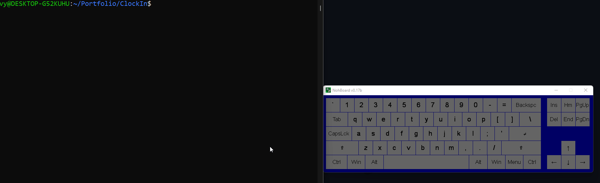
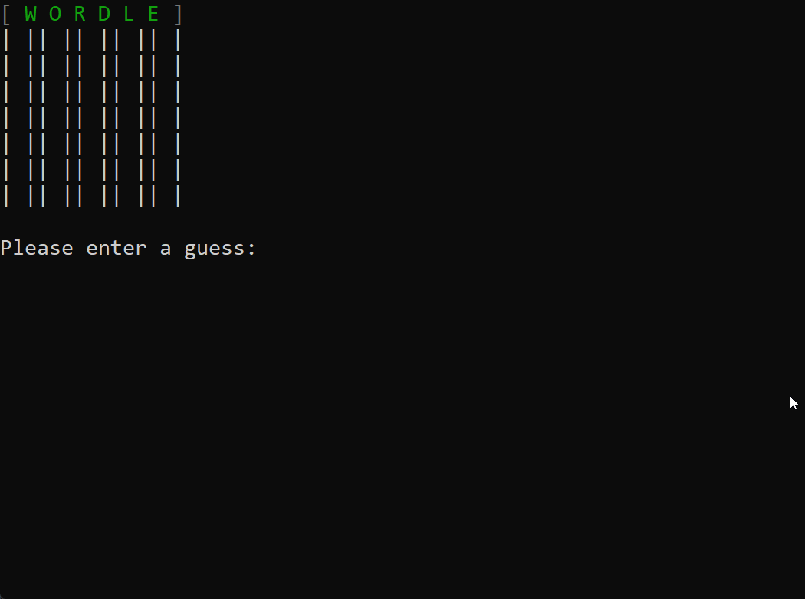
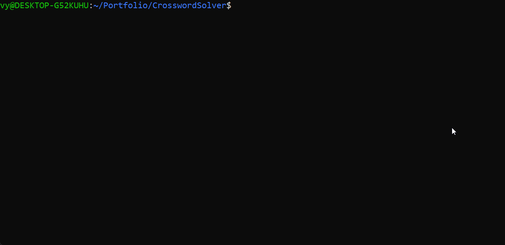

# Portfolio

## <b><u>ClockIn</u></b>

### Synopsis:
        A terminal-based, user-interactive program with multiple features
    relating to time management. Output to ANSI color-supporting terminals
    is recommended for the best user experience.

### Requirements:
1. [ncurses library](https://www.cyberciti.biz/faq/linux-install-ncurses-library-headers-on-debian-ubuntu-centos-fedora/)

### Modules:
    (1) Schedule
        (a) View existing schedule
        (b) Clear existing schedule
        (c) Add entries to schedule via text file
    (2) Timer
        (a) Edit existing timer values
            (I)   Hour -> [0, 23]
            (II)  Min  -> [0, 59]
            (III) Sec  -> [0, 59]
        (b) View existing timer
            (I)   Run / Resume
            (II)  Pause
            (III) Stop
        (c) View stopwatch
            (I)   Start
            (II)  Stop
            (III) Lap
            (IV)  Reset

### User Interaction:
The user may navigate around the program with arrow keys, and select a highlighted
option with the enter key.

</img>

### Notes
> Built in WSL environment. User experience may vary.  

 
 

## <b><u>Wordle Emulator</u></b>

### Synopsis:
        A terminal emulation of the popular game "Wordle".
    Enter 5-letter words to gain information about what the target word is.
    Each time the program is run, a word is randomly selected from the
    list of words in 'wordslist.txt'.

### Rules:
1. Green letters are in the correct spot.
2. Yellow letters are in the word, but not in the correct spot.
3. Gray letters are not in the word.
4. You have 7 tries to guess the word.

 

</img>

## <b><u>Cross Solver</u></b>

### Synopsis:
        An implementation of a recursive backtracking algorithm to solve
    a crossword puzzle given the locations of blanks and the list of words
    which are known to be the solution to the puzzle.

</img>
